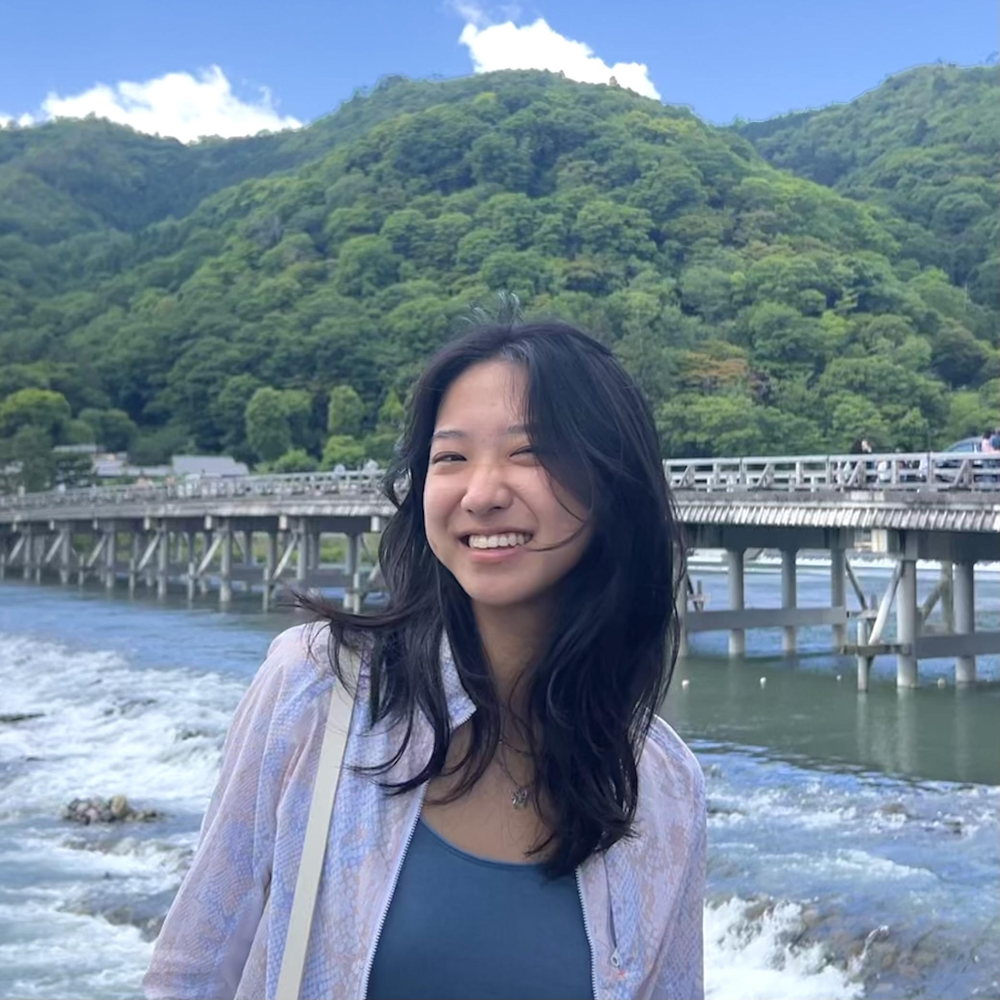

<!DOCTYPE html>
<html lang="en">
<head>
    <meta charset="UTF-8">
    <meta name="viewport" content="width=device-width, initial-scale=1.0">
    <title>elaine liu</title>
    
</head>
<body>
    

        <nav>
            

                <a href="#" class="logo">elaine liu</a>
                

                    <a href="#" class="nav-link" data-page="projects">projects</a>
                    <a href="#" class="nav-link" data-page="writing">writing</a>
                

            

        </nav>

        <!-- Home Page -->
        

            

                

                    
                    

                        
hey, i'm elaine!

                        
I'm studying EECS @ MIT and passionate about doing cool things that make people feel good. Right now, I'm interested in hardware/circuit design + AI/computer vision for health and consumer tech.

                        
I also love sunsets, <a href="https://www.instagram.com/eggshellsandoil/">art</a>, <a href="https://www.youtube.com/@elainexliu">youtube</a>, <a href="https://www.instagram.com/roadkillbuffet/">improv</a>, skateboarding, lifting, political philosophy, and strolling around in libraries.

                    

                

            

            

                <h2 class="section-title">now</h2>
                <ul class="bullet-list">
                    <li>Building consumer products for tics and BFRBs</li>
                    <li>Product at a stealth healthcare startup, working to make paid family caretaking more accessible
                        
Backed by Sequoia, Khosla, and Thrive

                    </li>
                    <li>Venture Partner at Contrary</li>
                </ul>
            

            

                <h2 class="section-title">previously</h2>
                <ul class="bullet-list">
                    <li>Conformable drug delivery methods and women's health devices @ Conformable Decoders in the Media Lab</li>
                    <li>GTM strategy, cash burn modeling, and investing for health and consumer tech and BCIs @ Thrive Capital</li>
                    <li>Schemed with Cohort 3.0 Admin @ Prod</li>
                    <li>Vehicle computer vision model optimization @ VIA + explored Taiwan</li>
                    <li>Controlled drug delivery methods + bioMEMS research @ the MIT Koch Institute</li>
                    <li>Fire alarm detection products and IoT data management systems @ Enventys Partners</li>
                    <li>Hereditary cataract prediction with ML research @ UNC Wilmington</li>
                </ul>
            

            

                <ul class="bullet-list">
                    <li><a href="https://fabacademy.org/2020/labs/charlotte/students/elaine-liu/">How to make almost anything</a> @ FabAcademy</li>
                    <li>Engineering for young girls @ sheMakes</li>
                    <li>I've built some things!</li>
                </ul>
            

        

        <!-- Projects Page -->
        

            

                <h1>projects</h1>
                
I love to build and create things. Here are some of my creative endeavors, ranging from simple projects made for fun to gadgets made to solve daily inconveniences to well-integrated products made to solve real world problems.

            

            

                

                    image placeholder
                

                

                    
May 2025 • Research

                    
EMG Detection: The Long (Analog) Way

                    
Building electromyography detection systems from the ground up, exploring analog signal processing techniques for biomedical applications.

                    <a href="/projects/2025/05/14/EMG.html" class="project-link">Read more</a>
                

            

            

                

                    image placeholder
                

                

                    
January 2025 • Consumer Health

                    
miro: a device to stop us at the mirror

                    
Designing interventions for body-focused repetitive behaviors through ambient computing and gentle behavioral nudges.

                    <a href="/projects/2025/01/18/miro.html" class="project-link">Read more</a>
                

            

            

                

                    image placeholder
                

                

                    
December 2024 • Team Research

                    
cUSD: a conformable ultrasound device

                    
Developing flexible, wearable ultrasound technology for continuous health monitoring applications.

                    <a href="/projects/2024/12/30/cusd.html" class="project-link">Read more</a>
                

            

            

                

                    image placeholder
                

                

                    
October 2024 • Web Application

                    
amber: a gen z lip-picking detection web app

                    
Computer vision application that helps users become aware of and reduce body-focused repetitive behaviors through real-time detection.

                    <a href="/projects/2024/10/12/amber.html" class="project-link">Read more</a>
                

            

            

                

                    image placeholder
                

                

                    
July 2020 • IoT

                    
navimap: an IoT interactive capacitive touch world map

                    
Interactive world map using capacitive touch sensors to trigger location-based content and stories.

                    <a href="/projects/2020/07/20/navimap.html" class="project-link">Read more</a>
                

            

            

                

                    image placeholder
                

                

                    
April 2022 • Product Design

                    
deng long: a carbon monoxide sensing lamp

                    
Ambient home safety device that provides elegant environmental monitoring through beautiful lighting design.

                    <a href="/projects/2022/04/15/deng-long.html" class="project-link">Read more</a>
                

            

            

                

                    image placeholder
                

                

                    
July 2020 • Team Project

                    
cupcake: an automatic batter dispenser machine

                    
Mechanical engineering project creating precision dispensing systems for consistent baking results.

                    <a href="/projects/2020/07/01/cupcake-batter.html" class="project-link">Read more</a>
                

            

            

                <h2 class="section-title">portfolios</h2>
                <ul class="portfolio-links">
                    <li>
                        <a href="https://sites.google.com/charlottelatin.org/elaineliudigitalportfolio/home">high school projects</a>
                        
documentation of engineering class projects and early explorations

                    </li>
                    <li>
                        <a href="http://fabacademy.org/2020/labs/charlotte/students/elaine-liu/">fab academy projects</a>
                        
20-week professional engineering course taught by MIT professor Neil Gershenfeld

                    </li>
                    <li>
                        <a href="https://github.com/elainexliu">github</a>
                        
recent builds and explorations

                    </li>
                </ul>
            

        

        <!-- Writing Page -->
        

            <h1>writing</h1>
            
Here are some of my thoughts that made it out of the drafts:

            
            <ul class="writing-list">
                <li class="writing-item">
                    
March 2025

                    <a href="#" class="writing-title">The Mom Test Takeaways</a>
                </li>
                <li class="writing-item">
                    
February 2025

                    <a href="#" class="writing-title">The loss of play in adulthood</a>
                </li>
                <li class="writing-item">
                    
January 2025

                    <a href="#" class="writing-title">Snippets of life</a>
                </li>
                <li class="writing-item">
                    
August 2024

                    <a href="#" class="writing-title">A few pieces of advice from One Piece</a>
                </li>
                <li class="writing-item">
                    
June 2023

                    <a href="#" class="writing-title">Transcendental Simplicity in a Modern Capitalist America</a>
                </li>
                <li class="writing-item">
                    
January 2025

                    <a href="#" class="writing-title">Hello world!</a>
                </li>
            </ul>
        

    

    
</body>
</html>